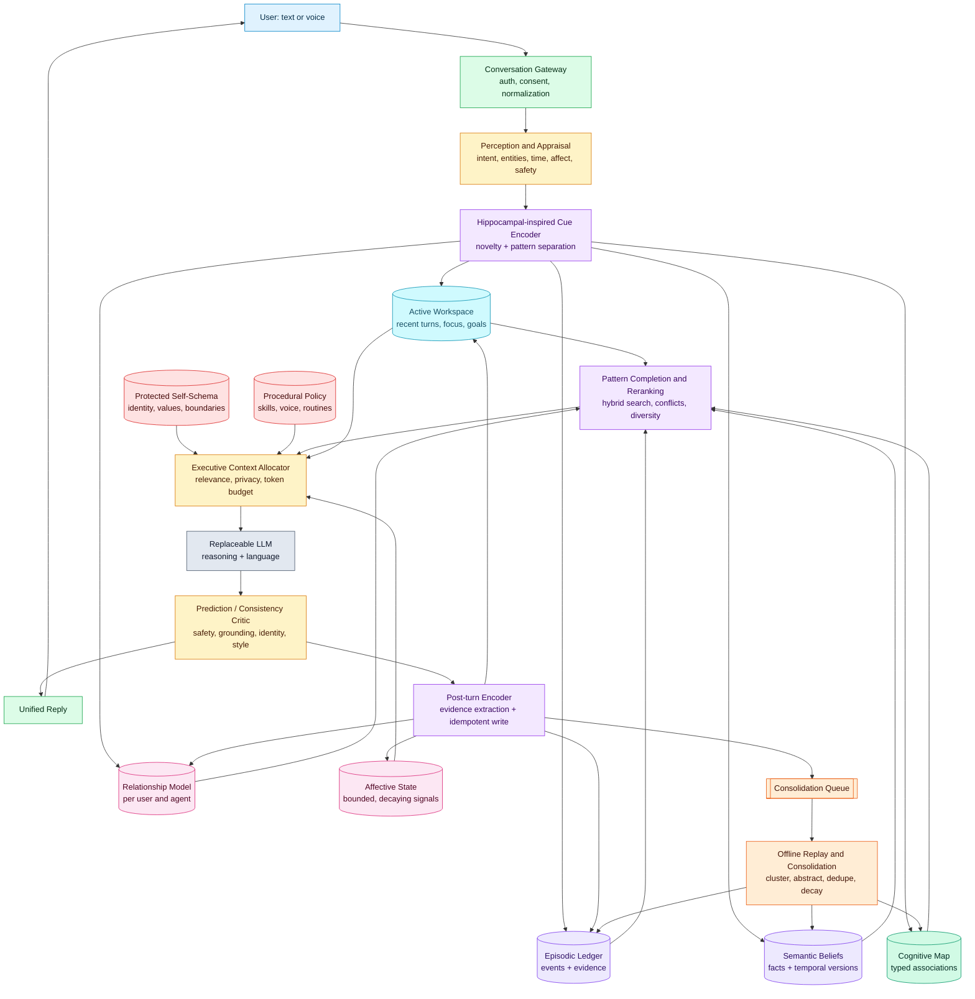
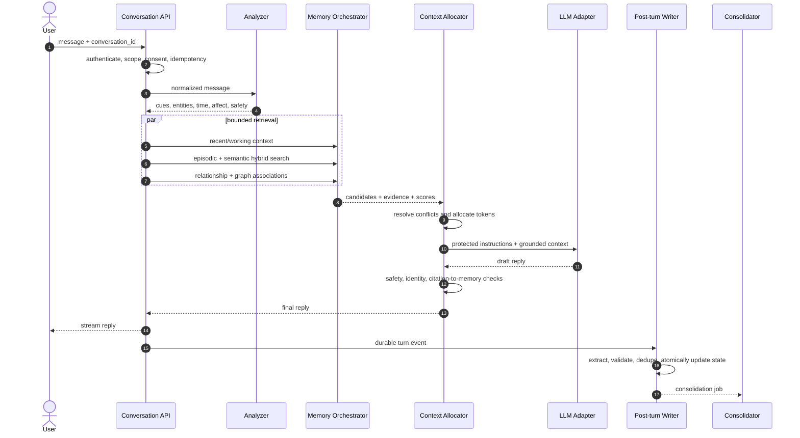

# Neuroscience-Inspired Architecture for a Memory-Augmented Conversational Agent

## Design position

This system should borrow **computational ideas**, not anatomical labels. An LLM
plus databases does not become a brain because components are named hippocampus
or cerebellum. The useful analogies are complementary fast/slow learning,
cue-based retrieval, pattern separation and completion, bounded working context,
offline consolidation, association graphs, and prediction-error-driven updates.

The original two-zone idea is practical, but two stores are not enough. Preserve
its user-facing goal—one continuous character—while implementing explicit memory
types behind the scenes. “Permanent” identity is protected by authorization and
versioning, not by pretending that biological long-term memories never change.

## What the biology contributes

| Neuroscience idea | Engineering translation | Important limit |
|---|---|---|
| Working memory and executive control | Bounded active workspace, current goals, recent turns, and a context-budget allocator | Working memory is distributed and debated; it is not merely a Redis list. |
| Hippocampal indexing | Encode an event once, retain links to distributed details, and retrieve from partial cues | Do not model individual anatomy or claim biological fidelity. |
| Pattern separation | Novelty checks, event fingerprints, temporal/entity boundaries, and duplicate control | Similar events must remain distinct when their evidence differs. |
| Pattern completion | Hybrid retrieval and graph expansion from partial cues | Completion is a hypothesis generator, never permission to invent facts. |
| Systems consolidation/replay | Offline clustering, abstraction, summary creation, and promotion | Keep source episodes; summaries are lossy derived records. |
| Reconsolidation | Version a recalled belief when new evidence changes it | Never destructively rewrite history after recall. |
| Semantic and episodic memory | Separate factual/generalized beliefs from time-and-place events | They interact; separation is a logical contract, not absolute biology. |
| Cognitive maps | Typed graph of people, places, topics, events, and goals | A graph improves association, not truthfulness. |
| Cerebellar prediction/error learning | Lightweight expectation model, response critic, and learned style/routine adapter | Do not store identity or autobiographical facts here. |
| Affect and salience | Bounded appraisal signals used for prioritization and subtle tone | These numbers are not literal emotions. |

Neuroscience supports several of these inspirations while also warning against a
literal mapping: systems-consolidation theories emphasize hippocampal–cortical
interaction and replay; alternative multiple-trace accounts retain a role for
the hippocampus in vivid episodic recall. Pattern separation/completion are useful
computational concepts, but their exact biological allocation remains nuanced.
Retrieval can also make memories modifiable, motivating versioned reconsolidation
instead of in-place edits. See [Frankland & Bontempi, 2005](https://www.nature.com/articles/nrn1607),
[Moscovitch et al., 2005](https://pmc.ncbi.nlm.nih.gov/articles/PMC1571502/),
[Deuker et al., 2014](https://pubmed.ncbi.nlm.nih.gov/24624058/), and
[Tronson & Taylor, 2007](https://www.nature.com/articles/nrn2090).

## Functional architecture



## Memory domains and mutation rules

| Domain | Examples | Lifetime | Writer | Retrieval behavior |
|---|---|---:|---|---|
| Protected self-schema | name, adult age representation, origin story, values, boundaries | Versioned, indefinite | Owner/admin only | Concise core always present; detail on demand |
| Procedural policy | speaking routines, tools, learned corrections | Versioned, slow | Developer or evaluated training process | Selected by task; never treated as biography |
| Active workspace | focus, unresolved references, last turns | Seconds to session | Runtime controller | Direct access; strict capacity and TTL |
| Prospective memory | promises, reminders, open goals | Until completed/expired | Evidence extractor + user | Triggered by time, entity, or intent |
| Episodic memory | a dated conversation event | Days to indefinite | Append-only turn encoder | Hybrid semantic/time/entity retrieval |
| Semantic belief | “user currently prefers X” | Versioned | Consolidator or explicit correction | Confidence and valid-time filtering |
| Relationship model | trust calibration, shared conventions, boundaries | Slow, per relationship | Bounded state reducer | Small structured summary only |
| Affective state | valence, arousal, concern, stress | Minutes to days | Deterministic reducer | Tone bias with decay to baseline |
| Cognitive map | user—works_on→project; event—occurred_at→place | Derived/versioned | Consolidator | One- or two-hop expansion with limits |
| Evidence ledger | raw turns and consent records | Policy-defined | Append-only gateway | Audit/correction, not prompt dumping |

The stable/evolving boundary is enforced by separate write capabilities, database
roles, API routes, schemas, and tests. Never rely on prompting alone for
immutability.

## One-turn sequence



### Failure semantics

- If analysis fails, reply using protected identity plus recent turns; write no
  inferred facts.
- If retrieval fails, degrade to recent context and state that recall is uncertain
  only when the conversation requires the missing fact.
- If generation fails, do not write extracted memories from the failed draft.
- Commit the user turn and final delivered reply with a shared turn ID. Retries
  must not duplicate events or state deltas.
- Consolidation is asynchronous and retryable. It may lag without blocking chat.

## Retrieval and context allocation

Use hybrid candidate generation: PostgreSQL full-text search, pgvector similarity,
explicit entity/time filters, recent-buffer access, and optionally bounded graph
neighbors. Normalize each feature within its candidate set, then rerank.

Starter score—not a scientific constant:

`score = .36 semantic + .18 lexical + .14 recency + .12 salience + .08 confidence + .07 goal_relevance + .05 association - penalties`

Penalties cover scope mismatch, contradiction uncertainty, duplication, stale
validity, and repeated overexposure. Apply maximal-marginal-relevance or a simple
diversity rule so ten near-duplicate memories do not crowd out context. Measure
and tune weights on a labeled retrieval set.

Context allocation order:

1. System safety and tool policy.
2. Minimal protected self-schema and behavioral boundaries.
3. Current user message and unresolved recent dialogue.
4. Current goal/prospective triggers.
5. High-confidence relevant semantic and episodic evidence.
6. Small affect/relationship summary.
7. Optional cognitive-map expansion.

Each injected memory is wrapped as untrusted background with ID, event time,
confidence, and source class. The model sees uncertainty and temporal conflicts,
but the final prose should be natural. “Seamless” means no clumsy store labels in
ordinary replies; it does not mean hiding that the product uses memory.

## Encoding, consolidation, and reconsolidation

```mermaid
flowchart LR
    T[Delivered Turn]:::a --> E[Evidence Extraction]:::b
    E --> S{Source says it?}:::gate
    S -->|no or inferred| D[Discard or transient hypothesis]:::bad
    S -->|yes| N[Novelty + pattern separation]:::b
    N --> X{Memory kind}:::gate
    X -->|event| EP[Episodic record]:::store
    X -->|goal/promise| PM[Prospective trigger]:::store
    X -->|current state| ST[Bounded state delta]:::store
    EP --> Q[Replay queue]:::off
    Q --> CL[Cluster by subject, time, relation]:::off
    CL --> AB[Abstract candidate belief]:::off
    AB --> CF{Conflict or change?}:::gate
    CF -->|no| SE[Semantic version + evidence links]:::store
    CF -->|yes| RV[Close old validity window<br/>create new version; never overwrite]:::warn
    SE --> DC[Decay accessibility, not audit evidence]:::off
    RV --> DC

    classDef a fill:#dbeafe,stroke:#2563eb,color:#172554;
    classDef b fill:#f3e8ff,stroke:#9333ea,color:#3b0764;
    classDef gate fill:#fef3c7,stroke:#d97706,color:#451a03;
    classDef store fill:#dcfce7,stroke:#16a34a,color:#052e16;
    classDef off fill:#ffedd5,stroke:#ea580c,color:#431407;
    classDef warn fill:#fee2e2,stroke:#dc2626,color:#450a0a;
    classDef bad fill:#f1f5f9,stroke:#64748b,color:#0f172a;
```



Consolidation should increase abstraction, not truth. A repeated claim can become
more retrievable but not more certain merely because the agent repeated it.
Reconsolidation is implemented as new versions and links (`supports`,
`contradicts`, `supersedes`), with the original evidence preserved.

## Practical full stack

### First production-shaped vertical slice

- Client: Next.js + TypeScript chat UI, SSE streaming, accessible memory controls.
- API: Python 3.12, FastAPI, Pydantic v2, SQLAlchemy 2, Alembic.
- Primary store: PostgreSQL 16 with pgvector, JSONB, row-level tenant policies,
  and built-in full-text search. Keep one database until load proves separation.
- Models: vendor-neutral `ChatModel`, `EmbeddingModel`, and `StructuredModel`
  interfaces; begin with one hosted OpenAI-compatible provider.
- Jobs: transactional outbox plus an in-process worker for development; move to
  Redis and Dramatiq/Celery only when multiple processes or scheduling require it.
- Observability: OpenTelemetry, structured logs, Sentry, optional Langfuse with
  prompt/memory content redacted by default.
- Testing: pytest, Hypothesis for state invariants, testcontainers for PostgreSQL,
  recorded model fixtures, and a scenario-evaluation runner.
- Delivery: Docker Compose locally; one API container, one worker, PostgreSQL,
  and a reverse proxy in the first deployed environment.

### Add only after measured need

- Redis for shared low-latency active workspace, distributed locks, or rate limits.
- Neo4j when two-hop graph retrieval beats PostgreSQL edge tables on evaluations.
- vLLM with a local model for privacy, cost, or latency requirements.
- Faster-Whisper for STT and a swappable TTS adapter for voice.
- Object storage for user-authorized audio; transcripts remain canonical.

### Suggested module boundaries

```text
src/
  api/                 # routes, auth, SSE, request/response schemas
  domain/              # memory types, policies, value objects, state reducers
  application/         # chat orchestration, retrieval, consolidation use cases
  adapters/
    models/            # chat, embedding, structured-output providers
    persistence/       # PostgreSQL repositories and outbox
    voice/             # later STT/TTS adapters
  workers/             # consolidation and deletion propagation
tests/
  unit/ integration/ scenarios/
evals/
  datasets/ reports/
```

## Minimal data model

- `agent_profile_versions`: protected identity payload, status, checksum,
  published_by, published_at.
- `turns`: append-only user/agent messages, delivery state, consent snapshot.
- `memory_items`: common envelope for episode, belief, goal, and summary records.
- `memory_evidence`: links a memory item to turns or other source records.
- `belief_versions`: subject, predicate, object, valid-time range, confidence,
  supersession chain.
- `state_snapshots`: working, affective, and relationship values with reducer
  version.
- `memory_edges`: typed cognitive-map links with evidence and confidence.
- `embedding_versions`: item, model, dimensions, checksum, vector.
- `outbox_jobs`: transactional, idempotent background work.
- `memory_tombstones`: deletion propagation and audit status without deleted text.

## Safety, privacy, and product honesty

- Obtain explicit memory consent and allow “do not remember this” per turn.
- Separate persona fiction from claims about the real user. Internally label early
  backstory as authored fiction.
- Avoid manipulative attachment optimization, exclusivity, guilt, or dependency.
- Do not infer sensitive traits (health, sexuality, religion, politics, precise
  location) into durable memory without an explicit product rule and consent.
- Encrypt transport and storage; isolate tenants; keep secrets outside prompts.
- Support correction and deletion with derived-data propagation.
- Show a human-readable “What I remember” view. Seamless conversation and
  transparent controls are compatible.
- If the system is uncertain, it should ask or speak tentatively rather than use
  pattern completion as fact generation.

## Evaluation: test continuity, not vibes alone

Track retrieval precision/recall on labeled cues, temporal contradiction accuracy,
duplicate rate, false-memory write rate, cross-user leakage (target: zero),
identity-mutation resistance, context token cost, latency, deletion completeness,
and human ratings of continuity, relevance, creepiness, and correction behavior.
Compare against two baselines: recent-window-only and undifferentiated vector
memory. The architecture earns its complexity only if it wins those comparisons.

## Scientific references

- [The organization of recent and remote memories](https://www.nature.com/articles/nrn1607)
- [Functional neuroanatomy of remote episodic, semantic and spatial memory](https://pmc.ncbi.nlm.nih.gov/articles/PMC1571502/)
- [Semantic Memory and the Hippocampus](https://pmc.ncbi.nlm.nih.gov/articles/PMC6993580/)
- [Role of Prefrontal Persistent Activity in Working Memory](https://pmc.ncbi.nlm.nih.gov/articles/PMC4700146/)
- [Human hippocampal pattern separation and completion](https://pubmed.ncbi.nlm.nih.gov/24624058/)
- [Molecular mechanisms of memory reconsolidation](https://www.nature.com/articles/nrn2090)
- [The cognitive map in humans](https://www.nature.com/articles/nn.4656)
- [Prediction signals in the cerebellum](https://pubmed.ncbi.nlm.nih.gov/32223891/)
