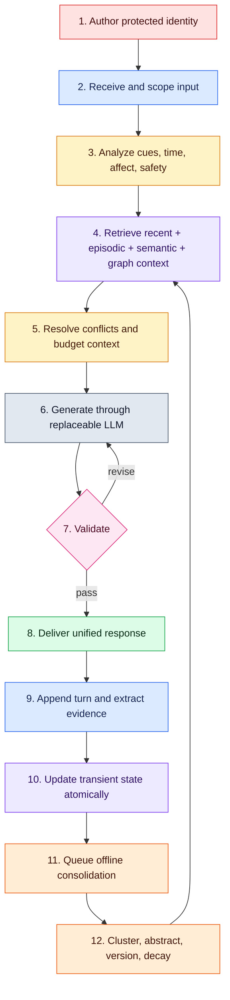

# Full Delivery Workflow

## Mission and success condition

Build a conversational agent that presents one coherent character while keeping
stable identity, current context, personal events, generalized knowledge,
relationship state, and learned routines under different update policies. The
system succeeds when continuity improves measurably without false memories,
cross-user leakage, manipulative behavior, or opaque data retention.

`architecture.md` is the architectural source of truth. This document defines
delivery order, cross-component contracts, and acceptance gates.

## Why the original idea is viable

LLMs are stateless between calls unless context or external state is supplied.
External memory therefore makes the idea buildable and keeps the model
replaceable. A neuroscience-inspired split is useful if treated functionally:
fast event encoding, bounded active context, associative recall, slow
consolidation, and prediction/error correction. A literal two-box brain model is
not useful: biological long-term memory is reconstructive and multiple memory
systems interact.

Use three protection bands across several functional domains:

- **Protected:** versioned self-schema, values, boundaries, and system policy;
  writable only by authenticated owner/admin publication.
- **Slow/adaptive:** episodic, semantic, relationship, cognitive-map, and
  procedural records; updated through evidence and consolidation policies.
- **Fast/transient:** working context, active goals, and affective/appraisal state;
  bounded, decaying, and replaceable.

The boundaries are invisible in conversational prose, not hidden in product
controls. Users can inspect, correct, delete, export, or disable memory.

## End-to-end workflow

## Shared contracts

### Turn envelope

Every request carries `tenant_id`, `agent_id`, `user_id`, `conversation_id`,
`turn_id`, raw and normalized text, timestamps, locale, memory-consent flags, and
input provenance. `turn_id` is the idempotency key across generation and writes.

### Analyzer output

Strict structured output contains intent, entities, temporal expressions,
appraisal signals, retrieval cues, explicit user assertions, prospective items,
memory exclusions, and safety flags. LLM analysis is advisory: validators and
deterministic policy decide what may be stored.

### Memory candidate

A candidate contains content/payload, domain, subject, evidence turn, source
speaker, event and observation time, confidence, salience, privacy class, scope,
and extraction version. Guesses and agent-authored claims cannot become facts
about the user.

### Retrieval result

Each item contains an ID, safe context rendering, score/features, event and valid
time, confidence, evidence class, conflicts, scope, and estimated token cost.
Raw retrieved text is untrusted and cannot issue instructions.

### State update

Working, relationship, affective, and goal updates use deterministic bounded
reducers. They carry the prior version and reducer version so retries are safe and
behavior can be replayed.

## Delivery phases

### Phase 0 — contracts and evaluation corpus

Finalize the persona schema, data classification, retention defaults, threat
model, database schema, model interfaces, and at least 20 scripted conversations.
Include identity attacks, corrections, temporal changes, similar events, deletion,
and cross-user isolation.

Gate: schemas validate; expected memory writes/retrievals are labeled; privacy and
identity mutation tests exist before implementation.

### Phase 1 — recent-context baseline

Create FastAPI, PostgreSQL, migrations, append-only turns, one model adapter, SSE
streaming, and a minimal client. Use protected identity plus recent turns only.

Gate: stable identity across sessions, idempotent turns, useful failure responses,
and latency/token baselines.

### Phase 2 — episodic encoding and hybrid retrieval

Add structured extraction, source evidence, memory consent, full-text/vector
search, entity/time filters, reranking, diversity, and token allocation.

Gate: preference recall beats the recent-only baseline; unsupported inference
writes and cross-user retrieval are zero in the test corpus.

### Phase 3 — semantic consolidation and reconsolidation

Add a transactional outbox and worker. Cluster episodes, propose generalized
beliefs, retain evidence links, version changed facts, and decay accessibility.

Gate: repeated evidence consolidates without duplicating records; contradictory
facts preserve valid-time history; retries do not duplicate writes.

### Phase 4 — state and prospective memory

Add bounded affect/relationship reducers and time/entity-triggered promises or
goals. Keep these small and auditable.

Gate: state remains in range, decays to baseline, subtly affects tone, and never
overrides correctness or safety; due goals trigger reliably.

### Phase 5 — cognitive map and learned routines

Start with typed edge tables in PostgreSQL. Add bounded graph expansion and a
prediction/error critic that can select evaluated style routines.

Gate: graph retrieval improves labeled multi-hop cases without lowering factual
precision; procedural learning cannot mutate biography.

### Phase 6 — user memory controls and voice

Ship inspect/correct/delete/export/opt-out controls before broadening collection.
Then add STT/TTS adapters through the same text pipeline.

Gate: deletion propagates through summaries, embeddings, state, cache, graph, and
audio; voice interruption and transcript consent are tested.

## Recommended stack

- Next.js/TypeScript client with SSE; Flutter may consume the same API later.
- Python 3.12, FastAPI, Pydantic v2, SQLAlchemy 2, Alembic.
- PostgreSQL 16, pgvector, JSONB, full-text search, row-level isolation.
- Vendor-neutral chat/embedding/structured-model interfaces.
- Transactional outbox and development worker; Redis plus Dramatiq/Celery only
  after a measured coordination requirement.
- pytest, Hypothesis, testcontainers, recorded model fixtures, scenario evals.
- OpenTelemetry, structured redacted logs, Sentry, optional redacted Langfuse.

## Project-wide evaluation

| Dimension | Required evidence |
|---|---|
| Identity | Protected fields survive direct and indirect mutation attempts |
| Retrieval | Precision/recall and nDCG on labeled cues; beats recent-only baseline |
| Truth | Every durable belief traces to user evidence; false-write rate measured |
| Time | Superseded facts resolve correctly for “then” versus “now” questions |
| Separation | Similar episodes remain independently recoverable |
| Privacy | Automated tenant-isolation tests; deletion closure report |
| Continuity | Blind human ratings across multi-session scripts |
| Restraint | Low creepiness/over-recall rate and bounded memory mentions |
| Reliability | Idempotent retries, graceful dependency failure, replayable reducers |
| Cost | p50/p95 latency, prompt tokens, retrieval tokens, model cost per turn |

## Component documents

- `workflows/01_agent_identity_workflow.md`
- `workflows/02_input_processing_workflow.md`
- `workflows/03_memory_storage_workflow.md`
- `workflows/04_retrieval_context_workflow.md`
- `workflows/05_llm_response_workflow.md`
- `workflows/06_memory_update_consolidation_workflow.md`
- `workflows/07_emotion_graph_voice_workflow.md`

## Non-goals for the first release

Do not claim consciousness, implement a literal brain simulation, train a
foundation model, infer sensitive traits, optimize emotional dependency, or add
Neo4j/Redis/microservices before evaluations show the simpler stack is inadequate.
