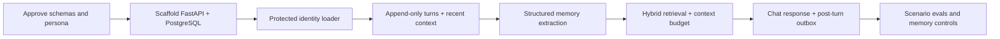

# Suggested Next Steps

## Recommended next milestone

Build one thin, testable text-chat vertical slice. Do not add Redis, Neo4j, voice,
fine-tuning, or multiple model providers yet.

## First implementation backlog

1. Convert `prototypes/test_self.YAML` into a validated `AgentProfile` Pydantic
   schema and publish it as profile version 1.
2. Scaffold `src/` and `tests/` using the module boundaries in `architecture.md`.
3. Add Docker Compose with PostgreSQL 16 + pgvector and Alembic migrations for
   profiles, turns, memory items/evidence, belief versions, state, and outbox.
4. Implement `POST /v1/conversations/{id}/turns` with request idempotency and SSE
   response streaming.
5. Implement recent-turn context only; establish latency and continuity baselines.
6. Add structured, evidence-backed extraction into episodic memories. Reject
   unsupported inferences and respect a per-turn `remember=false` flag.
7. Add full-text + vector candidate retrieval, deterministic reranking, diversity,
   conflict notes, and a hard context-token budget.
8. Add a post-turn transactional outbox and an idempotent consolidation worker.
9. Add `GET/PATCH/DELETE /v1/memories` for inspection, correction, and forgetting.
10. Run the scenario suite before adding any advanced infrastructure.

## Five must-pass scenarios

- A user cannot change the agent's protected identity through conversation.
- A clearly stated preference is recalled in a later session with its evidence.
- A changed preference supersedes the old one without erasing history.
- Two similar events on different dates remain distinct.
- Memories from user A are never retrievable in user B's conversation.

## Decision gates after the vertical slice

- Add Redis only if measured active-context latency or multi-process coordination
  requires it.
- Add a graph database only if graph queries outperform a PostgreSQL edge table on
  relationship/cognitive-map evaluations.
- Add voice only after text transcripts, consent, deletion, and interruption
  semantics are reliable.
- Consider fine-tuning only after prompt/retrieval errors are separated from model
  style errors with evaluation data.

