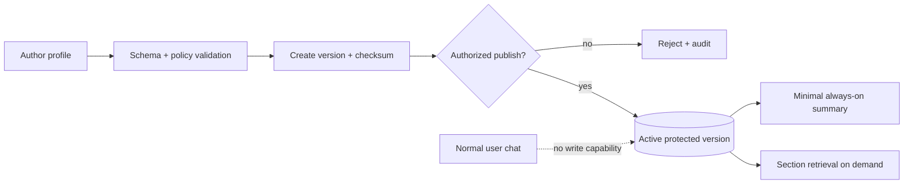

# Workflow 01: Agent Identity and Core Profile

## Mission

Define the agent before any conversation starts. This profile is the stable foundation that makes the character feel like a continuous person instead of a blank chatbot.

## Scope

Build the identity layer only. Do not implement chat, retrieval, or memory consolidation in this chunk.

## Optimized Model

Call this a **protected self-schema**, not biological permanent memory. Human
identity and autobiographical memory can change; immutability here is an
engineering capability boundary. Publish immutable versions so authorized
changes are possible without rewriting history.

Separate canonical claims, behavioral parameters, boundaries, authored fiction,
and presentation. Gender/pronouns and voice configuration must not be used to
stereotype temperament, interests, or behavior.

## Required Inputs

- Agent name and ID.
- Identity fields: gender, age representation, origin, background.
- Personality trait scores.
- Core traits and values.
- Early experiences and formative events.
- Communication style.
- Boundaries and immutable facts.

## Technical Direction

For v0.1, store the profile as YAML or JSON. The existing `prototypes/test_self.YAML` can act as a seed profile shape, but production prototypes should treat this file as data, not executable logic.

For v0.2, migrate the profile into PostgreSQL tables:

- `agents`
- `agent_identity`
- `agent_personality`
- `agent_core_values`
- `agent_early_experiences`
- `agent_relationships`

Create embeddings for profile sections that may be semantically retrieved, such as early experiences, worldview, skills, or autobiographical foundations.

## Implementation Requirements

- Load the profile at backend startup or per-agent request.
- Validate with a strict schema.
- Mark immutable fields as protected.
- Provide admin-only update mechanisms later.
- Never allow normal user chat to overwrite core identity.
- When contradicted by the user, the agent should respond in-character rather than explaining storage rules.
- Enforce protection in repository/API/database authorization, not only prompts.
- Store schema/profile version, status, checksum, publisher, and publish time.
- Reject profiles that combine a minor character with adult sexual behavior.
- Retrieve detailed backstory only when useful; keep the always-on core concise.

## Test Plan

- Validate a complete profile.
- Reject missing required identity fields.
- Reject normal memory writes that target immutable fields.
- Confirm the context builder receives a concise identity summary.
- Simulate the user saying a false identity claim and verify it is not persisted.
- Verify only an owner/admin capability can publish a new version.
- Verify old versions remain auditable and authored fiction never becomes a fact about the user.

## Builder Prompt

Create the identity subsystem for a dual-memory AI companion. Use a structured profile file first, validate it strictly, and expose a read-only profile object to the rest of the backend. Protect name, origin, core traits, core values, and foundational backstory from normal conversation updates. Write tests that prove the agent profile loads correctly, malformed profiles fail validation, and user messages cannot mutate immutable identity.
