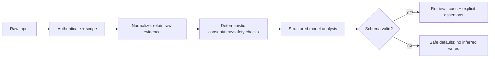

# Workflow 02: Input Processing

## Mission

Turn raw user input into clean text plus structured signals for retrieval, memory writing, emotion tracking, and response generation.

## Scope

Build the analyzer for text input first. Voice can be added later through STT.

## Pipeline

User message -> cleaning -> intent detection -> entity extraction -> emotion estimation -> memory query generation -> candidate memory write detection.

## Technical Stack

- Backend: Python, FastAPI.
- Schemas: Pydantic.
- Analyzer: LLM structured output for v0.1.
- Optional STT: faster-whisper, OpenAI Whisper, Google Speech-to-Text, or Azure Speech.

## Structured Output

The analyzer should return:

- `clean_text`
- `intent`
- `entities`
- `emotion.label`
- `emotion.intensity`
- `memory_queries`
- `candidate_memories`
- `active_goal_candidates`
- `safety_flags`
- `temporal_expressions` with normalized value and uncertainty
- `explicit_assertions` with speaker, subject, predicate, object, and evidence span
- `memory_directives`: remember, correct, forget, or do-not-store
- `input_provenance`: user speech, quotation, role-play, or STT

## Implementation Requirements

- Keep raw input and normalized input separate.
- Validate all analyzer output with Pydantic.
- Retry or fall back safely if the LLM returns malformed structured output.
- Include time references as explicit extracted values where possible.
- Log analyzer output for debugging retrieval quality.
- Treat quoted, hypothetical, sarcastic, interrogative, and model-authored text as
  non-evidence unless the user explicitly adopts the claim.
- Store evidence spans for proposed facts; deterministic policy controls durable writes.
- Redact private telemetry and version the analyzer prompt and model.

## Test Plan

- Extract entities from project, person, place, and date references.
- Detect emotional tone such as anxiety, excitement, frustration, or sadness.
- Generate useful memory queries for semantically related recall.
- Handle very short messages.
- Handle slang, typos, and informal phrasing.
- Return safe defaults when analysis fails.
- Distinguish “I hate tea” from “Alice said ‘I hate tea’” and “Do I hate tea?”
- Respect “do not remember this” even when the message is highly salient.

## Builder Prompt

Build an input analyzer for a memory-augmented AI companion. Accept a user message, normalize it, and produce strict structured output containing intent, entities, emotion estimate, memory search queries, candidate memory writes, possible goals, and safety flags. Use an LLM with structured output for the first prototype, wrap it with schema validation and retry behavior, and write tests covering normal, emotional, ambiguous, and malformed inputs.
