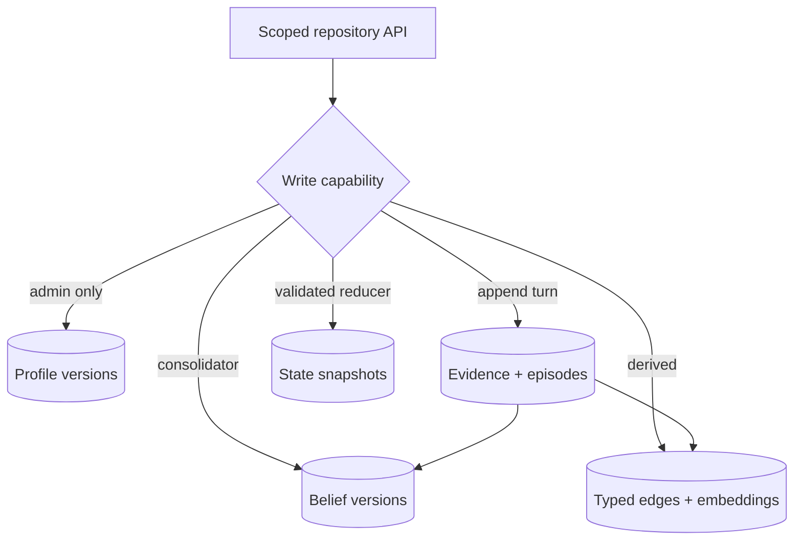

# Workflow 03: Memory Storage

## Mission

Create storage for immutable identity, long-term autobiographical memory, and short-term working memory.

## Memory Levels

The three protection bands remain useful, but expose precise domains: protected
self-schema, procedural policy, working state, prospective goals, episodic events,
semantic belief versions, relationship/affective state, cognitive-map edges, and
the source evidence ledger.

Level 1: Core Identity

- Immutable.
- Contains foundational profile data.
- Stored in YAML/JSON for v0.1, PostgreSQL for v0.2.

Level 2: Long-Term Memory

- Slowly changeable.
- Contains important events, preferences, relationship facts, repeated patterns, and consolidated summaries.
- Stored in PostgreSQL plus pgvector for the production-shaped prototype.

Level 3: Short-Term Memory

- Fast changing.
- Contains recent messages, current emotion, active goals, temporary observations, and working context.
- Stored in bounded PostgreSQL rows/state first; Redis is an optional later cache.

For a production-shaped prototype, prefer PostgreSQL + pgvector from the start.
It can hold recent rows, JSONB state, full-text indexes, vectors, and typed edges.
Redis may later cache or coordinate, but must not be the only source of truth.

## Recommended Metadata

Every memory should support:

- `memory_id`
- `agent_id`
- `user_id`
- `content`
- `memory_type`
- `created_at`
- `last_accessed`
- `importance`
- `emotional_intensity`
- `confidence`
- `strength`
- `source`
- `entities`
- `associations`
- `embedding`
- `expires_at`
- tenant/scope IDs and privacy class
- event time and observation time
- valid-time range and supersession link
- source evidence and extractor/schema versions
- embedding model/dimensions/checksum and lifecycle state

## Implementation Requirements

- Keep identity writes separate from normal memory writes.
- Support memory creation, retrieval by ID, semantic search, update, decay, and expiration.
- Store embeddings for searchable memories.
- Support TTL for short-term memory.
- Preserve time history for changed facts instead of overwriting blindly.
- Enforce row-level tenant isolation and scope every repository method.
- Make writes idempotent and use a transactional outbox.
- Propagate deletion to summaries, vectors, caches, state, and graph edges.
- Decay retrieval accessibility, not audit evidence or truth confidence.

## Test Plan

- Create long-term and short-term memories.
- Search memories by semantic similarity.
- Expire short-term memories.
- Reject unauthorized identity mutation.
- Preserve metadata on updates.
- Store changed preferences with temporal context.
- Prove complete cross-user isolation and idempotent retry behavior.
- Delete a source episode and verify derived material is removed or rebuilt.

## Builder Prompt

Build the storage layer for the protected, adaptive, and transient memory bands.
Use PostgreSQL plus pgvector as the first durable source of truth and keep storage
behind domain repositories. Implement profile versions, append-only evidence,
episodes, belief versions, state snapshots, embeddings, edges, tombstones, and a
transactional outbox. Write tests for scoped creation/retrieval, TTL, profile
protection, idempotency, temporal changes, cross-user isolation, and deletion.
