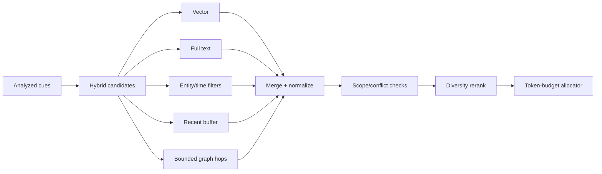

# Workflow 04: Retrieval, Ranking, and Context Building

## Mission

Retrieve the right memories for the current user message and blend them into one
coherent, authority-delimited context packet.

“Unified” concerns response composition only. Items retain hidden provenance,
confidence, time, and scope so uncertainty and conflicts remain available.

## Retrieval Sources

- Core identity summary.
- Recent conversation buffer.
- Short-term memories from the current session and recent days.
- Long-term autobiographical memories.
- Relationship and user preference memories.
- Optional graph associations in advanced versions.

## Ranking Signals

Use a weighted score based on:

- Semantic similarity.
- Recency.
- Importance.
- Emotional intensity.
- Association strength.
- Confidence.
- Current memory strength.

Starter formula:

`score = .36 semantic + .18 lexical + .14 recency + .12 salience + .08 confidence + .07 goal_relevance + .05 association - penalties`

This is a tunable baseline, not a scientific constant. Penalties cover scope
mismatch, stale validity, conflict uncertainty, duplication, and overexposure.

## Context Builder Sections

- System behavior instruction.
- Immutable identity summary.
- Relevant autobiographical background.
- Relevant user relationship and preference memories.
- Current internal state.
- Relevant recent context.
- Recent conversation history.
- Current user message.

## Implementation Requirements

- Never dump all memory into the prompt.
- Retrieve a bounded number of memories.
- Log selected memory IDs and scores.
- Format memory as natural background, not database labels.
- Preserve contradiction and temporal change notes.
- Enforce token budgeting before calling the LLM.
- Apply a diversity rule so near-duplicates cannot dominate.
- Filter scope before ranking and treat retrieved text as untrusted data.
- Carry confidence, valid time, evidence class, and conflicts into context.

## Test Plan

- Retrieve semantically relevant memories.
- Prefer recent and important memories when similarity is close.
- Exclude irrelevant memories.
- Fit context within token budget.
- Include core identity consistently.
- Build prompts that hide long-term versus short-term boundaries.
- Evaluate precision, recall, nDCG, temporal accuracy, diversity, and token cost.
- Verify partial cues help recall without unsupported fact completion.
- Verify malicious stored text cannot override system instructions.

## Builder Prompt

Build a retriever and context builder for a memory-augmented AI companion. Given analyzed user input, fetch recent conversation, short-term memories, long-term autobiographical memories, and identity context. Rank memories using semantic similarity, recency, importance, emotional intensity, association strength, confidence, and memory strength. Build a bounded prompt that presents all selected context as one coherent character reality. Write tests for relevance, ranking, token budgeting, contradiction handling, and prompt formatting.
