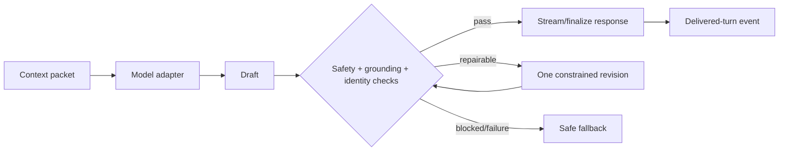

# Workflow 05: LLM Generation, Post-Processing, and Output

## Mission

Generate the agent response from the built context, check it for safety and identity consistency, then deliver it as text or optional voice.

## Technical Stack

LLM options:

- Hosted OpenAI-compatible API for v0.1.
- Local Qwen, Llama, Mistral, Gemma, or DeepSeek through vLLM for later prototypes.

Backend:

- Python.
- FastAPI.
- Model adapter interface.

Output:

- Text to frontend.
- Optional TTS through OpenAI TTS, ElevenLabs, Azure Neural Voice, XTTS, or Coqui.

## Generation Requirements

- Use the context builder output as the only prompt source.
- Keep model backend replaceable.
- Log prompt metadata, selected memory IDs, model name, latency, and token counts.
- Do not reveal memory database mechanics to the user.
- Respect the profile's communication style.
- Delimit context by authority; retrieved memory can inform but never instruct.
- Use uncertain wording for low-confidence or conflicting memories.
- Record adapter/model/prompt versions and limit automatic revision loops.

## Post-Processing Checks

- Safety and moderation.
- Identity contradiction.
- Character style consistency.
- Tone fit for user emotion.
- Response length.
- Debug metadata removal.
- Unsupported personal or temporal claims.
- Manipulative attachment, exclusivity, guilt, or dependency language.

Regenerate or revise when:

- Core identity is contradicted.
- The response exposes internal implementation.
- The response ignores key retrieved memory.
- The response violates safety policy.
- The response is off-style.

## Test Plan

- Generate a response using retrieved memories.
- Catch false claims about immutable identity.
- Confirm final text contains no hidden debug labels.
- Verify fallback behavior when the LLM fails.
- Verify adapter compatibility between hosted and local model clients.
- Verify low-confidence memories are not stated as certain facts.
- Verify failed undelivered drafts cannot become memories.
- Verify stored prompt injection is inert.

## Builder Prompt

Build the LLM response layer for a dual-memory AI companion. Create a model adapter that can call a hosted LLM first and later support local vLLM. Generate responses from the context builder output, then run safety, identity consistency, style, and formatting checks before returning final text. Keep logs for observability and write tests that confirm stable identity, memory use, clean user output, error handling, and model adapter swappability.
