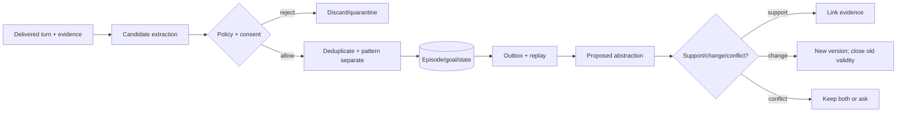

# Workflow 06: Memory Extraction, Update, Consolidation, and Decay

## Mission

After each interaction, extract useful memory candidates, update short-term memory, and periodically consolidate important patterns into long-term memory.

## Per-Turn Memory Update

Inputs:

- User message.
- Agent response.
- Analyzer output.
- Retrieved memories.
- Current state.

Outputs:

- New short-term event memories.
- Updated current user emotion.
- Updated agent emotional state.
- Updated active goals.
- Candidate user facts and preferences.
- Relationship deltas.
- Contradiction candidates.

## Importance Policy

- 0.0 to 0.3: discard or short TTL.
- 0.3 to 0.6: keep temporarily.
- 0.6 to 0.8: mark for possible consolidation.
- 0.8 to 1.0: strong long-term candidate.

Importance should consider novelty, emotion, repetition, user relevance, agent relevance, future usefulness, and relationship significance.

Salience affects accessibility and retention, not truth. Repetition of the agent's
own output must never raise confidence in a claim about the user.

## Consolidation Pipeline

Recent memories -> group related memories -> summarize -> score importance -> detect duplicates -> detect contradictions -> promote, merge, or discard -> long-term memory.

Run consolidation:

- After every fixed number of conversations.
- On a schedule such as daily.
- Manually from a developer tool during testing.

## Decay and Reinforcement

- Memory strength decreases over time.
- Accessed or repeated memories receive reinforcement.
- Low-strength short-term memories expire.
- Significant repeated experiences become stronger and more likely to consolidate.

## Contradiction Handling

Do not blindly overwrite old memory. Preserve temporal change:

- Previous value.
- New value.
- Confidence.
- Evidence.
- Changed date.

For example, store that the user previously preferred one language but now prefers another, instead of keeping two conflicting favorites.

Implement reconsolidation as append/version/link, never destructive editing.
Summaries and beliefs retain source episode IDs. Explicit correction outranks
older inference while audit history remains until deletion is requested.

## Test Plan

- Extract important memories from emotional user messages.
- Avoid storing trivial details as long-term facts.
- Consolidate repeated short-term memories into one summary.
- Merge duplicates.
- Decay stale low-importance memories.
- Preserve temporal history for changed preferences.
- Keep similar events distinct by date, participants, and evidence.
- Prove model repetition cannot self-confirm and job retries are idempotent.
- Verify deletion removes or recomputes derived records.

## Builder Prompt

Build the memory extraction and consolidation subsystem. After each chat turn, analyze the user message and agent response to extract memory candidates, importance, emotional intensity, confidence, entities, associations, and possible contradictions. Store useful items in short-term memory and update goals and emotion state. Add a background consolidator that groups, summarizes, scores, deduplicates, decays, and promotes memories into long-term storage. Write tests for extraction quality, importance thresholds, duplicate merging, decay, promotion, and changed-fact handling.
