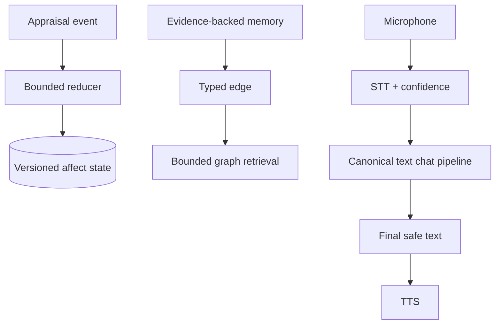

# Workflow 07: Emotional State, Cognitive Map, and Voice Extensions

## Mission

Extend the prototype beyond basic memory by adding persistent emotional dynamics, graph-based cognitive maps, and optional voice input/output.

These are three optional extensions with separate evaluation gates; do not build
them as one coupled subsystem.

## Emotional State

Represent emotion as numerical state:

- Valence: -1 to +1.
- Arousal: 0 to 1.
- Dominance: 0 to 1.
- Trust: 0 to 1.
- Attachment: 0 to 1.
- Stress: 0 to 1.
- Warmth or concern where useful.

Keep appraisal separate from relationship belief. Prefer valence, arousal,
concern, and interaction confidence. “Attachment” is unsafe as an optimization
target and must never drive dependency or exclusivity.

Update rules:

- Apply small deltas from each interaction.
- Clamp all values to valid ranges.
- Decay toward baseline over time.
- Use emotional state to influence tone, not to override task usefulness.
- Use deterministic bounded reducers, maximum per-event deltas, elapsed-time
  decay toward a baseline, and a reducer version.

## Cognitive Map

Use graph memory when vector retrieval is not enough.

Graph nodes:

- Agent.
- User.
- People.
- Places.
- Projects.
- Events.
- Concepts.
- Goals.
- Emotions.
- Preferences.

Graph relationships:

- knows.
- works_on.
- studies_at.
- likes.
- worried_about.
- presented_at.
- related_to.
- promised.
- changed_preference_to.

Recommended stack:

- PostgreSQL typed edges for the first graph prototype.
- Keep graph retrieval optional and additive.
- Do not let graph facts overwrite immutable identity.
- Start with PostgreSQL typed edges; adopt Neo4j only after it wins evaluations.
- Give every edge scope, confidence, valid time, and evidence; bound traversal.

## Voice Extension

Input:

- Microphone -> STT -> text.
- Options: faster-whisper, OpenAI Whisper, Google Speech-to-Text, Azure Speech.

Output:

- Final text -> TTS -> audio.
- Options: OpenAI TTS, ElevenLabs, Azure Neural Voice, XTTS, Coqui.

Requirements:

- Text chat must remain the source of truth.
- Voice should call the same backend chat pipeline.
- Store transcripts, not only audio blobs.
- Clean text before TTS.
- Preserve STT confidence and let users correct low-confidence spans.
- Define interruption, partial-turn, replay, retention, and deletion semantics.
- Do not retain raw audio by default.

## Test Plan

- Emotion values update slowly and remain bounded.
- Emotional state changes tone subtly.
- Graph associations improve recall for related concepts.
- Graph retrieval does not create false facts.
- STT produces usable text for the normal pipeline.
- TTS receives final user-safe text only.
- Prove extreme input cannot produce a dramatic one-turn personality shift.
- Measure graph benefit over vector/full-text retrieval on labeled cases.
- Verify deletion covers transcript, derived memories, and authorized audio.

## Builder Prompt

Add the extensions independently and behind feature flags. Implement a small
numerical appraisal state with bounded deterministic deltas, decay, and subtle
tone influence. Add evidence-backed typed graph edges in PostgreSQL and adopt a
dedicated graph database only if evaluations justify it. Add STT/TTS adapters
while keeping text as the canonical pipeline. Test state stability, anti-
manipulation rules, graph retrieval quality, transcript consent/deletion, and
voice interruption.
